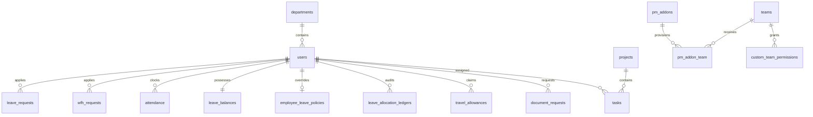

# Inter Smart Employee Portal — Master Product & Operational Manual
### Comprehensive Feature Guide, Role Specifications & Workflow Architecture

> **Document Classification:** Master Operational & Demonstration Specification  
> **Target Audience:** Company Management, Department Heads, Technical Leads, and HR Executives  
> **System Scope:** Complete Inter Smart Portal Ecosystem (Frontend, Backend, Database, Biometric Engine, and Integrations)  
> **Typography Standard:** Strict **Proxima Nova** Typography  
> **Technology Stack:** Next.js (App Router, TypeScript) · Tailwind CSS · Laravel API (PHP 8.2+) · MySQL (cPanel) · External eSSL Biometric Integration · Hubstaff API

---

# Table of Contents
1. [Executive Summary & System Vision](#1-executive-summary--system-vision)
2. [User Role Hierarchy & Master Permission Matrix](#2-user-role-hierarchy--master-permission-matrix)
3. [Module 1: Authentication, Global Navigation & Shell](#3-module-1-authentication-global-navigation--shell)
4. [Module 2: Dashboard & Real-Time Operational Hub](#4-module-2-dashboard--real-time-operational-hub)
5. [Module 3: Biometric Attendance & Device Engine](#5-module-3-biometric-attendance--device-engine)
6. [Module 4: Leave & Work From Home (WFH) Suite](#6-module-4-leave--work-from-home-wfh-suite)
7. [Module 5: Leave Policy Management System (Add-on Engine)](#7-module-5-leave-policy-management-system-add-on-engine)
8. [Module 6: Project & Task Management Suite](#8-module-6-project--task-management-suite)
9. [Module 7: Hubstaff Productivity & QA Bug Tracker](#9-module-7-hubstaff-productivity--qa-bug-tracker)
10. [Module 8: Add-ons Architecture & Team Provisioning](#10-module-8-add-ons-architecture--team-provisioning)
11. [Module 9: Travel Allowance (TA) & Reimbursement Workflow](#11-module-9-travel-allowance-ta--reimbursement-workflow)
12. [Module 10: HR Services, Documents & Policy Handbook](#12-module-10-hr-services-documents--policy-handbook)
13. [Module 11: Company Announcements & Marquee Flash Ticker](#13-module-11-company-announcements--marquee-flash-ticker)
14. [Module 12: People, Teams & The Hall of Fame](#14-module-12-people-teams--the-hall-of-fame)
15. [Module 13: Birthday & Work Anniversary Celebrations](#15-module-13-birthday--work-anniversary-celebrations)
16. [Module 14: Awards & Recognition Leaderboard](#16-module-14-awards--recognition-leaderboard)
17. [Module 15: Community Social Feed (Posts, Polls & Praise)](#17-module-15-community-social-feed-posts-polls--praise)
18. [Module 16: Helpdesk & Internal Issue Ticketing](#18-module-16-helpdesk--internal-issue-ticketing)
19. [Module 17: Database Schema & Entity Relationships](#19-module-17-database-schema--entity-relationships)
20. [Module 18: Operational Invariants & Manager Demonstration Script](#20-module-18-operational-invariants--manager-demonstration-script)

---

# 1. Executive Summary & System Vision

The **Inter Smart Employee Portal** is an all-in-one digital operating system built to streamline every facet of organizational workflow at Inter Smart. It integrates real-time biometric hardware clocks, dynamic leave cycle and probation accrual engines, project delivery boards, productivity analytics, HR service fulfillment, peer recognition, and internal corporate communication.

### Core Objectives:
1. **Zero Human Error in Attendance & Payroll**: Automated biometric synchronization from eSSL devices with timeline rebuilding and high-precision second-level calculations.
2. **Dynamic Policy Compliance**: Automated monthly leave accrual, probation tracking, 2-year casual leave carry-forward, and annual sick leave expiration.
3. **Delivery Excellence**: Integrated Kanban task management, task forecasting, overdue tracking, Hubstaff productivity telemetry, and dedicated QA bug tracking.
4. **Transparent HR Fulfillment**: Self-service requests for official paperwork (Salary Certificates, Experience Letters, NOCs) and Travel Allowances.
5. **Vibrant Workplace Culture**: Community social feed, peer recognition badges, real-time marquee flash ticker, birthday wish automation, and Hall of Fame awards.

---

# 2. User Role Hierarchy & Master Permission Matrix

The portal defines four primary role tiers:

1. **Super Admin**: Complete master authority over all company data, policies, financial approvals, team settings, biometric audits, and system configuration.
2. **HR (Human Resources)**: Authority over employee records, onboarding, leave/WFH review, document issuance, company announcements, policy publishing, and culture management.
3. **Team Lead**: Authority over assigned project delivery, task boards, QA metrics, team attendance review, travel allowance claims, and peer praise.
4. **Employee (General Staff)**: Personal self-service workspace for clock monitoring, task execution, leave/WFH/TA applications, document requests, peer recognition, and social feed.

### Master Feature vs. Role Permission Matrix

| Feature / Screen | Super Admin | HR | Team Lead | Employee |
| :--- | :---: | :---: | :---: | :---: |
| **Login & Password Self-Recovery** | ✅ Full | ✅ Full | ✅ Full | ✅ Full |
| **Command Palette (Alt+K) Quick Search** | ✅ Global | ✅ Global | ✅ Scoped | ✅ Scoped |
| **Flash Ticker Display (Birthdays/Announcements/Awards)** | ✅ Global | ✅ Global | ✅ Global | ✅ Global |
| **Live Biometric Clock Widget & Daily Punch Timeline** | ✅ Global Audit | ✅ Global Audit | ✅ Team Audit | ✅ Self |
| **Apply for Leave / WFH (Full / Half-day / Range)** | ✅ Apply / Override | ✅ Apply | ✅ Apply | ✅ Apply |
| **Leave & WFH Approvals Workflow** | ✅ Final Approve | ✅ Review & Approve | ❌ View Team | ❌ View Self |
| **Manage Approved Leaves/WFH (Cancel / Override)** | ✅ Full Access | ❌ | ❌ | ❌ |
| **Leave Balances Dashboard & Adjustments** | ✅ Edit & Adjust | ✅ View All | ❌ | ❌ (View self) |
| **Leave Policy Management (Add-on Module)** | ✅ Full Control | ❌ | ❌ | ❌ |
| **Team & Role Permissions (Add-on Module)** | ✅ Full Control | ❌ | ❌ | ❌ |
| **Biometric Attendance Matrix & Punch Overrides** | ✅ Full Edit | ✅ View All | ✅ Team Matrix | ✅ Self Detail |
| **Project Repository (Clients, Budget, Timeline)** | ✅ Full CRUD | ✅ View | ✅ Assigned Lead | ✅ Assigned View |
| **All Tasks / Kanban Board / Forecast Tasks** | ✅ Full CRUD | ✅ Task Catalog | ✅ Team Tasks | ✅ Assigned Tasks |
| **Hubstaff Productivity & Time Sync** | ✅ Global Telemetry | ❌ | ✅ Team Telemetry | ❌ |
| **QA Bug Tracking & Reports** | ✅ Global QA | ❌ | ✅ Assigned Teams | ✅ Assigned Teams |
| **Add-ons Marketplace & Team Provisioning** | ✅ Full Control | ❌ | ❌ | ❌ |
| **Travel Allowance (TA) Apply & Status Tracking** | ✅ Apply / Audit | ❌ | ✅ Apply & Track | ✅ Apply & Track |
| **Travel Allowance (TA) Management & Payment** | ✅ Audit & Pay | ❌ | ❌ | ❌ |
| **Company Announcements (Publish, Schedule, Pin)** | ✅ Full Control | ✅ Full Control | ❌ View Only | ❌ View Only |
| **Document Requests (Request Certificate, NOC, Letter)** | ✅ Audit | ✅ Fulfill & Upload | ✅ Self Request | ✅ Self Request |
| **HR Policies Handbook (Create / Upload / Version)** | ✅ Full Control | ✅ Full Control | ✅ View / Download | ✅ View / Download |
| **Employee Master Directory (Create, Edit, Archive)** | ✅ Full CRUD | ✅ Full CRUD | ✅ Directory View | ✅ Directory View |
| **Departments / Teams Management** | ✅ Full CRUD | ✅ Full CRUD | ✅ View Lead | ✅ View |
| **The Hall of Fame (Monthly / Quarterly Awards)** | ✅ Full Manage | ✅ Full Manage | ✅ View | ✅ View |
| **Birthday Wishes Inbox & Animated Wish Drawer** | ✅ Full Manage | ✅ Full Manage | ✅ Send Wish | ✅ Send Wish |
| **Awards & Recognition (Badges & Leaderboard)** | ✅ Full Manage | ✅ Full Manage | ✅ Nominate / Award | ✅ View / Receive |
| **Community Feed (Posts, Polls, Praise, Mentions)** | ✅ Post / Moderate | ✅ Post / Moderate | ✅ Post / Vote / Praise | ✅ Post / Vote / Praise |
| **Helpdesk & Issue Ticketing (Raise & Resolve)** | ✅ Assign / Resolve | ✅ Assign / Resolve | ✅ Raise & Track | ✅ Raise & Track |

---

# 3. Module 1: Authentication, Global Navigation & Shell

### 3.1. Authentication System
- **Bearer Token Architecture**: Uses Laravel Sanctum tokens stored in secure, reactive client state.
- **Login Screen (`/login`)**:
  - Validates corporate work email and password.
  - Upon authentication, hydrates the user profile, permissions, department assignments, and active add-on licenses.
  - Automatically redirects users to their appropriate dashboard view.
- **Forgot Password (`/forgot-password`) & Reset (`/reset-password`)**:
  - Secure cryptographic token generated and delivered to the employee's registered corporate email.
  - Validates token expiration and enforces corporate password standards.

### 3.2. Global Navigation & Top Bar
- **Header Structure**:
  - **Company Logo**: High-definition Inter Smart brand identity with link to home dashboard.
  - **Global Search (`Alt + K` Command Palette)**: Allows instant modal search across employees, navigation routes, projects, tasks, and quick actions.
  - **Interactive Quick Actions Button (🚀 Rocket Icon)**: Opens immediate trigger menu for Apply Leave, Apply WFH, Apply TA, Raise Issue, and Request Document.
  - **Favorite Bookmarks Dropdown (🔖)**: Enables any employee to pin frequently accessed modules for 1-click navigation.
  - **Notification Center (🔔)**: Real-time dropdown showing unread alerts (leave approval status, task assignments, document fulfillment, birthday wishes, and issue responses) with unread counters.
  - **User Profile Pill (`RoyalAvatar` & Role Badge)**: Displays employee profile picture, formatted name, role tag (*Super Admin*, *HR*, *Team Lead*, *Employee*), and quick logout.

### 3.3. Sidebar Navigation Groups
The sidebar dynamically renders based on the logged-in user's role:
1. **Home / Dashboard**: Direct link to the personalized executive overview.
2. **Leave & WFH**: Apply Leave, Apply WFH, Leave Balances, Leave Approvals, Manage Approved Leaves.
3. **Project Management**: Overview, Project Status, Projects, All Tasks, My Tasks, Overdue Tasks, Completed Tasks, Forecast Tasks, Bug Reports, Hubstaff, Task Catalog.
4. **Add-ons** *(Dedicated Top-Level Super Admin Group)*: All Add-ons, Team & Role Permissions Management, Leave Policy Management.
5. **Finances / Travel Allowance**: Apply for TA, TA Status, Manage TA Requests.
6. **HR Services**: Updates & Announcements, Request Documents, HR Policies Handbook.
7. **People & Org**: Employees Directory, Departments / Teams, Attendance Management, The Hall of Fame, Birthday Wishes, Recognition Leaderboard.
8. **My Account**: Profile, Notifications, Raise an Issue.

---

# 4. Module 2: Dashboard & Real-Time Operational Hub

The `/dashboard` route serves as the central command center for every employee.

```
┌─────────────────────────────────────────────────────────────────────────────────────────────┐
│ 📢 FLASH MARQUEE TICKER: 🎉 Happy Birthday John Doe! 📢 Pinned: Onam Celebration Guidelines │
├─────────────────────────────────────────────────────────────────────────────────────────────┤
│ 👤 Good Morning, Alex | 🏢 Design Team | 📅 29 Aug 2026 | ⚡ Super Admin                      │
├──────────────────────────────────────┬──────────────────────────────────────────────────────┤
│ 🕒 LIVE BIOMETRIC CLOCK WIDGET       │ 📊 LEAVE BALANCES OVERVIEW                           │
│ Status: 🟢 WORKING NOW               │ 🌴 Casual Leave: 10.5 CL (incl. 2.0 Carry Forward)   │
│ First In: 09:14 AM | Last Out: --    │ 🏥 Sick Leave:    6.0 SL                             │
│ Working Time: 5h 42m | Break: 35m    │ 📌 Dynamic Payroll Cycle: 26th of month              │
├──────────────────────────────────────┴──────────────────────────────────────────────────────┤
│ 🚀 QUICK ACTIONS: [🌴 Apply Leave] [💻 Apply WFH] [🚗 Apply TA] [📄 Request Doc] [🎫 Issue] │
├──────────────────────────────────────┬──────────────────────────────────────────────────────┤
│ 🎂 TODAY'S CELEBRATIONS & MILESTONES │ 📋 RECENT NOTICES & COMMUNITY ACTIVITY               │
│ • Sarah Jenkins (Birthday Today!)    │ • Office Infrastructure Upgrades Completed           │
│   [🎉 Send Wish Button]              │ • New QA Tracker Add-on Activated for PHP Team      │
│ • David Miller (2nd Work Anniv!)     │ • Monthly Town Hall Scheduled for Friday             │
└──────────────────────────────────────┴──────────────────────────────────────────────────────┘
```

### Key Components:
1. **Global Flash Marquee Ticker**: Continuous animated ticker highlighting pinned corporate announcements, active awards, and birthdays. Pauses on hover.
2. **Live Biometric Punch Widget**: Real-time connection to eSSL device events displaying first punch, active status, cumulative working time, and breaks.
3. **Leave Balance Gauges**: Circular SVG gauges displaying available CL, 2-year carry forward, and SL.
4. **Milestone Celebrations Card**: Today's birthdays, upcoming birthdays (next 7 days), work anniversaries, and new joiners. Includes 1-click **Birthday Wish Drawer**.
5. **Recent Announcements Feed**: Quick access to top notices published by HR.

---

# 5. Module 3: Biometric Attendance & Device Engine

### 5.1. Hardware Integration Architecture
- The portal reads live transaction events from external biometric devices (eSSL / ZKTeco).
- **SELECT-Only Invariant**: All connections to external device databases are strictly read-only to preserve biometric audit integrity.
- **Idempotency Key**: Transactions are keyed uniquely as `source_system + source_table + source_event_id`.

### 5.2. Biometric Timeline Rebuilding Logic
Unlike naive systems that only capture first-in and last-out, Inter Smart Portal reconstructs the **full daily punch timeline**:
1. **Multi-Session Calculation**: Multiple IN/OUT punches throughout the day are paired into discrete work sessions and break sessions.
2. **Late IN Reopening Rule**: If an employee punches `OUT` at 5:00 PM but punches `IN` again at 6:30 PM, the system reopens the day, sets checkout to `NULL`, and resumes live working calculations.
3. **High-Precision Second Accumulation**: Raw work intervals are summed in seconds first (`Σ seconds`), and converted/floored to minutes only after the final summation to avoid fractional rounding loss.

```
PUNCH SEQUENCE:
  IN (09:00 AM) ───► OUT (01:00 PM)  [Session 1: 4h 00m = 14,400s]
  OUT (01:00 PM) ──► IN (01:45 PM)   [Break 1:     45m =  2,700s]
  IN (01:45 PM) ───► OUT (06:15 PM)  [Session 2: 4h 30m = 16,200s]
  ──────────────────────────────────────────────────────────────────
  TOTAL WORKING TIME: 14,400s + 16,200s = 30,600s = 8 Hours 30 Minutes
  TOTAL BREAK TIME:   2,700s = 45 Minutes
```

### 5.3. Attendance Management Matrix (`/attendance/management`)
- **Monthly Matrix Grid**: Displays every employee across all dates of the selected month.
- **Status Indicators**:
  - 🟢 **Present (P)**: Met standard working hours.
  - 🔵 **WFH (Work From Home)**: Approved remote work.
  - 🟡 **Half Day (HD)**: Worked partial day or approved half-day leave.
  - 🔴 **Absent (A)**: No punches recorded without approved leave/WFH.
  - 🟣 **On Leave (L)**: Approved Casual/Sick/Emergency leave.
  - ⚠️ **Missing Punch-Out**: IN recorded without closing OUT punch.
- **Daily Detail Modal**: Clicking any cell reveals the exact punch sequence, device IP, total hours, and break logs.

---

# 6. Module 4: Leave & Work From Home (WFH) Suite

### 6.1. Apply Leave (`/leaves/apply`)
- **Leave Types Supported**:
  - **Casual Leave (CL)**: Planned personal time off (accrues monthly, carries forward for 2 years).
  - **Sick Leave (SL)**: Medical leave (accrues monthly, expires annually).
  - **Emergency Leave**: Urgent unannounced absence.
  - **Leave Without Pay (LOP)**: Extended absence beyond available balances.
- **Duration Options**:
  - **Full Day**: Single or multiple calendar dates.
  - **Half Day**: First Half (morning) or Second Half (afternoon).
- **Validation**: System checks available balance and displays instant warning if requested days exceed balance or if the employee is in probation.

### 6.2. Apply WFH (`/wfh`)
- **Remote Work Description**: Employee inputs planned deliverables for the remote day.
- **Duration**: Full Day or Half Day.
- **Auto-Sync**: Approved WFH automatically marks the attendance matrix as `WFH` for that date.

### 6.3. Leave Approvals (`/leaves/approvals`)
- **HR & Super Admin Review Queue**:
  - Tabs: *Pending Requests*, *Approved History*, *Rejected Requests*.
  - Detail View: Employee name, department, leave type, date range, total days, available balance, reason, and submission time.
  - Action: **Approve** (deducts balance, updates attendance, sends notification) or **Reject** (requires mandatory review remarks).

### 6.4. Manage Approved Leaves/WFH (`/manage-leaves`)
- Exclusive Super Admin screen to review and cancel or modify previously approved leave/WFH records in emergency situations, automatically rolling back deducted balances.

---

# 7. Module 5: Leave Policy Management System (Add-on Engine)

Located at **Main Menu → Add-ons → Leave Policy Management** (`/project-management/addons/leave-policy`), this engine enforces all 29 leave policy requirements.

```
┌─────────────────────────────────────────────────────────────────────────────────────────────┐
│ ⚙️ LEAVE POLICY MANAGEMENT SYSTEM                                                           │
├─────────────────────────────────────────────────────────────────────────────────────────────┤
│ [Tab 1: General Policy] [Tab 2: Employee Allocations] [Tab 3: Audit Ledger] [Tab 4: Runner] │
├─────────────────────────────────────────────────────────────────────────────────────────────┤
│ 📅 Configurable Cycle Start Day: [ 26th ] of every month                                    │
│ ⏳ Common Probation Period:     [ 6 Months ] from joining date                             │
│ 🌴 Default Monthly Accrual:     [ +1.00 CL ] and [ +1.00 SL ]                               │
│ 🔁 Casual Leave Rule:           2-Year Carry Forward (Expires at 2-year cycle boundary)    │
│ ❌ Sick Leave Rule:             Annual Expiration (No multi-year carry forward)             │
└─────────────────────────────────────────────────────────────────────────────────────────────┘
```

### Complete Invariant Rules & Workflows:

#### Rule 1: Configurable Monthly Cycle Start Day
- The Super Admin configures any day of the month (e.g., `26`, `1`, `15`) as the cycle cutoff.
- All leave, WFH, and attendance calculations dynamically resolve start and end dates based on this setting.

#### Rule 2: Automatic Monthly Accrual (CL & SL)
- Runs daily at `00:01 AM` via Artisan command `leave:process-policy-cycle`.
- If current day matches the configured `monthly_cycle_start_day`, every eligible employee receives `+1.00 CL` and `+1.00 SL` (or custom quota).
- **Idempotency Guarantee**: Keyed by `cycle_key` (e.g. `2026-08-26`). Refreshes, retries, or manual runs will never double-credit.

#### Rule 3: Probation Rules & Next-Day Eligibility
- Standard probation: 6 months from `joining_date`.
- During probation, employees do **not** receive automatic monthly accrual.
- On natural completion of probation, the employee becomes eligible starting the **next day**.

#### Rule 4: Admin Manual Leave Addition Probation Clearance Exception
- If an admin manually adds or adjusts leave balances for an employee during probation, the system marks `probation_cleared_manually = true`.
- The employee is treated as having completed probation and begins receiving automatic monthly accrual starting from the very next cycle.

#### Rule 5: 2-Year CL Carry Forward vs. Annual SL Expiration
- **Casual Leave (CL)**: Unused CL carries forward across year boundaries for up to 2 years (`cl_carry_forward_years = 2`). Expired amounts are recorded in the audit ledger.
- **Sick Leave (SL)**: Unused SL resets to `0` at the end of the annual cycle with zero multi-year carry forward.

#### Rule 6: Preservation of Existing & Manual Balances
- Existing balances and manual adjustments are strictly preserved. Future monthly credits add directly to the actual current balance.

#### Rule 7: Employee-Wise Allocation Overrides
- Admins can customize `custom_monthly_cl`, `custom_monthly_sl`, and `custom_probation_months` for specific employees (e.g. senior hires or contract staff).

#### Rule 8: Immutable Audit Ledger & Cycle Runner
- Full transaction history recording every balance change with `opening_balance`, `amount`, `closing_balance`, `transaction_type`, `cycle_key`, `modified_by`, and timestamp.
- **Cycle Runner & Simulator**: Allows Super Admin to dry-run or execute cycles on demand with live terminal log output.

---

# 8. Module 6: Project & Task Management Suite

### 8.1. Projects Repository (`/project-management/projects`)
- **Project Attributes**: Client Name, Project Title, Team Lead, Department, Budget, Start Date, Target Delivery Date, Project Health Status (*On Track, At Risk, Delayed*), and progress bar.
- **Project Details Screen (`/project-management/projects/[id]`)**: Full breakdown of all linked tasks, assigned developers, QA bug counts, and delivery milestones.

### 8.2. Task Kanban & List Board (`/project-management/tasks`)
- **Interactive Kanban Columns**:
  1. 📥 **Backlog**: Queued items awaiting sprint scheduling.
  2. 📝 **To Do**: Prioritized tasks ready for development.
  3. ⚡ **In Progress**: Actively being worked on by developers.
  4. 🔍 **In Review / QA**: Submitted for code review or quality assurance testing.
  5. ✅ **Completed**: Verified and delivered.
- **Task Metadata**:
  - Title, Description, Assigned Team Members (with `RoyalAvatar`).
  - Priority: `Low` (Slate), `Medium` (Blue), `High` (Orange), `Urgent` (Red).
  - Estimated Hours vs. Actual Hours Logged.
  - Linked QA Bug count and Hubstaff tracking status.
- **Dynamic Team Filter Switcher (Cross-Team Permission)**:
  - By default, general employees see their department's tasks.
  - When a user possesses the **Cross-Team Task Visibility (`task_cross_team_view`)** permission or is a Super Admin, the **Team Filter Switcher** dropdown dynamically renders in the top navigation bar.
  - Enables instant cross-department switching to inspect task tables, employee workload groups, and milestone delivery for any selected department.

### 8.3. Specialized Task Views
- **My Tasks (`/project-management/tasks/my`)**: Filtered view showing only tasks assigned to the logged-in user.
- **Overdue Tasks (`/project-management/tasks/overdue`)**: Automated escalation list of all tasks that have exceeded their due date, highlighting days overdue and responsible team members.
- **Completed Tasks (`/project-management/tasks/completed`)**: Archive of delivered work with delivery date filters.
- **Forecast Tasks (`/project-management/tasks/forecast`)**: Resource capacity planner allowing team leads to forecast upcoming team bandwidth and project timelines.
- **Task Catalog (`/project-management/task-catalog`)**: Standardized reusable task templates for HR and Project Managers.

---

# 9. Module 7: Hubstaff Productivity & QA Bug Tracker

### 9.1. Hubstaff Telemetry Integration (`/project-management/hubstaff`)
- **Real-Time Productivity Sync**: Connects to Hubstaff API to retrieve active tracked hours, keyboard/mouse activity percentage, and activity snapshots.
- **Team Comparison**: Team Leads and Super Admins can monitor tracked hours vs. estimated task hours to identify bottlenecks.

### 9.2. QA Bug Reports & Metrics (`/project-management/bug-reports`)
- **Bug Categorization**:
  - 🐞 **HTML Bugs**: Layout, typography, responsiveness, and frontend visual defects.
  - ⚙️ **Functional Bugs**: Logic failures, API errors, broken form submissions, and database faults.
- **Bug Metrics**: Total Bugs Reported, Open Bugs, Resolved Bugs, Bug Tracker Link (Google Sheets / Jira / ClickUp integration).

---

# 10. Module 8: Add-ons Architecture & Team Provisioning

Located at **Main Menu → Add-ons** (`/project-management/addons`):

### Add-on Types & Scoping Rules:
1. **Team & Role Permissions Management (`/project-management/addons/permissions`)**:
   - Master capability matrix allowing Super Admin to assign fine-grained capabilities to specific delivery teams or exclusively to **Team Leads Only**.
   - **Supported Permissions**:
     - 👁️ **Cross-Team Task Visibility & Switcher (`task_cross_team_view`)**: Enables the **Team Switcher dropdown** on the All Tasks page, allowing assigned teams/leads to view other teams' task data tables, employee groupings, and backlogs.
     - ➕ **Cross-Team Task Creation & Assignment (`task_cross_team_assign`)**: Allows assigned teams/leads to create and assign tasks to members of other departments.
     - 🐞 **Global QA Bug Reports Access (`bug_reports_cross_team`)**: Allows assigned teams/leads to inspect QA bug metrics and tracker links across all teams.
     - 📅 **Department Attendance Matrix Access (`attendance_team_view`)**: Allows assigned teams/leads to inspect the full attendance matrix and daily biometric punches for all departments.
     - ⏱️ **Hubstaff Productivity & Telemetry View (`hubstaff_team_view`)**: Allows assigned teams/leads to view Hubstaff activity rates and tracked hours for team members.
   - **3-State Scoping Controls per Team**:
     - ⚪ **Off (Disabled)**: No cross-team access.
     - 👑 **Leads Only**: Privilege granted strictly to designated Team Leads of that department.
     - 👥 **All Members**: Privilege granted to all active members and leads of that department.
2. **Team-Scoped Add-ons (e.g. Bug Tracker & QA Metrics)**:
   - Super Admin can enable/disable the module globally.
   - Super Admin selects which delivery teams have access (*Design, HTML, PHP, Project Coordinator, QA, WordPress*).
   - Only members and leads of selected teams will see this module and its menu items.
3. **Company-Wide Global Add-ons (e.g. Leave Policy Management)**:
   - Configured as a global system engine governing all staff.
   - Displays a clean overview card with direct link to **Configure Policy Management** without team assignment selectors.

---

# 11. Module 9: Travel Allowance (TA) & Reimbursement Workflow

### 11.1. Apply for Travel Allowance (`/ta/apply`)
- **Claim Fields**:
  - Travel Date & Purpose (Client meeting, on-site visit, hardware procurement).
  - Origin & Destination addresses.
  - Mode of Conveyance: Two-Wheeler (Motorcycle), Four-Wheeler (Car), Public Transport (Bus/Train/Cab).
  - Odometer Readings: Starting km, Ending km, Total km calculated automatically.
  - Rate Calculation: Auto-multiplied by company standard per-km rate.
  - Receipt / Bill Upload: Multi-file attachment for fuel bills, toll receipts, and parking slips.

### 11.2. TA Claim Status (`/ta/status`)
- Employee tracker showing status progression:
  - 🕒 **Submitted**: Awaiting review.
  - 🔍 **Under Review**: Checked by accounts/admin.
  - 🟢 **Approved**: Claim validated and approved for reimbursement.
  - 💰 **Paid / Disbursed**: Payment transferred to employee bank account.
  - 🔴 **Rejected**: Claim declined with reason remarks.

### 11.3. Manage TA Requests (`/ta/management`)
- Super Admin verification dashboard to audit travel claims, inspect odometer photos and fuel bills, adjust claim amounts, approve claims, and record transaction disbursement details.

---

# 12. Module 10: HR Services, Documents & Policy Handbook

### 12.1. Request Documents (`/documents`)
- **Supported Document Types**:
  1. **Salary Certificate / Statement**: Official income proof for loans, visas, or banking.
  2. **Experience Letter**: Verification of tenure and responsibilities.
  3. **Relieving Letter**: Official separation documentation.
  4. **NOC (No Objection Certificate)**: For travel, education, or financial purposes.
  5. **Bonafide Employment Letter**: General proof of active employment.
  6. **Custom Document Request**: Free-text request for non-standard paperwork.
- **HR Fulfillment Workflow**:
  - Employee submits request with reason/purpose.
  - HR receives notification, generates official document, and uploads signed PDF.
  - Employee receives notification with instant 1-click PDF download.

### 12.2. HR Policies Handbook (`/policies`)
- Central corporate document repository organized by categories (*Code of Conduct, Leave Policy, IT Security, Work Hours, POSH Guidelines, Remote Work Policy*).
- Supports PDF downloads, revision histories, and version tracking.

---

# 13. Module 11: Company Announcements & Marquee Flash Ticker

### 13.1. Community-Style Announcements Feed (`/announcements`)
- **Rich Post Card Architecture**:
  - **Author Header**: Author avatar (`RoyalAvatar`), formatted name (`RoyalName`), relative publication time (`2 hours ago`), globe icon (🌐), category badge (🏷️), and **Pinned Badge** (📌).
  - **Title & Text**: Bold headline with multi-line formatted announcement content.
  - **Banner Media Frame**: Instagram/Community-style centered image display (`max-h-[380px]` with zero empty side wings).
  - **Expiry & Schedule Footer**: Displays scheduled release date and auto-expiration timestamp.
  - **Clean Corporate Newsfeed**: Strictly displays clean organizational notices with zero like/comment clutter.
- **Admin Management**: Super Admin and HR can create, edit, pin, schedule, and delete notices.

### 13.2. Real-Time Marquee Flash Ticker Integration
- When an announcement is marked with **"Pin this announcement to the top"**, it automatically streams across the top **Flash Ticker** on every page with cyan megaphone styling (📢).

---

# 14. Module 12: People, Teams & The Hall of Fame

### 14.1. Employee Master Directory (`/employees`)
- **Directory Grid & List**: Comprehensive staff list with search, department filtering, and profile cards.
- **Employee Onboarding (`/employees/create`)**:
  - Personal info, designation, department, reporting lead, work email, phone, salary details, and biometric code.
  - **Retro Biometric Matching**: When a new employee is created with an existing biometric code, the system automatically links and retroactively recalculates all prior historical device logs.

### 14.2. Departments & Teams (`/teams`)
- Department hierarchy management (*Design, HTML, PHP, QA, WordPress, Marketing, HR, Accounts*).
- Team Lead assignment, member rosters, and linked project allocations.

### 14.3. The Hall of Fame (`/hall`)
- Prestigious recognition showcase highlighting:
  - **Star of the Month**: Exceptional monthly individual contributor.
  - **Quarterly Excellence Awards**: Top-performing project delivery teams.
  - **Annual Champions**: Long-standing organizational pillars.

---

# 15. Module 13: Birthday & Work Anniversary Celebrations

### 15.1. Birthday Celebrations & Flash Ticker
- Automated detection of daily birthdays.
- Displays animated celebratory cake badge (🎉) on the global Flash Ticker.

### 15.2. Birthday Wish Drawer & Inbox (`/birthday-wishes`)
- **Direct Wish Drawer**: Clicking "Send Wish" on any birthday card opens a smooth slide-in drawer with pre-composed celebratory templates and custom message input.
- **Birthday Inbox**: The birthday celebrant receives a dedicated inbox filled with personalized peer messages, gift card badges, and confetti animations.

---

# 16. Module 14: Awards & Recognition Leaderboard

### 16.1. Peer & Lead Recognitions (`/recognitions`)
- **Recognition Badges**:
  - ⭐ **Superstar**: For outstanding overall contribution.
  - 🚀 **Team Player**: For exceptional cross-team collaboration.
  - 💡 **Innovator**: For creative problem solving and architectural ideas.
  - 🎯 **High Performer**: For consistently exceeding delivery targets.
  - 👏 **Helping Hand**: For supporting colleagues and mentoring juniors.
  - 🌟 **Customer Delight**: For stellar client feedback.

### 16.2. Recognition Leaderboard (`/recognitions/leaderboard`)
- Gamified organizational leaderboard ranking employees based on accumulated recognition points, awarded badges, and monthly spotlights.

---

# 17. Module 15: Community Social Feed (Posts, Polls & Praise)

Located at `/community`, this provides an internal social collaboration network:

```
┌─────────────────────────────────────────────────────────────────────────────────────────────┐
│ 👥 COMMUNITY FEED & INTERNAL SOCIAL NETWORK                                                 │
├──────────────────────────────────────┬──────────────────────────────────────────────────────┤
│ 📌 CREATE POST:                      │ 📊 2-COLUMN COLLABORATION FEED:                      │
│ [📝 Standard Post]                   │ • Peer Praise: "Kudos to Sarah for launching v2!"    │
│ [📊 Create Live Poll]                │ • Community Poll: "Preferred Friday Tech Talk Topic" │
│ [⭐ Share Peer Praise]               │ • Photo Posts: Team outings and hackathons           │
│ Features: Multi-photo slider,        │ • Real-time vote percentage tracking                 │
│ @mentions, rich media attachments    │ • Year, Month, and Category filters                  │
└──────────────────────────────────────┴──────────────────────────────────────────────────────┘
```

### Feed Capabilities:
1. **Standard Posts**: Multi-line formatted updates with `@` user mention autocomplete and Instagram-style multi-image slider carousels.
2. **Interactive Community Polls**: Single-choice questions with dynamic vote progress bars, anonymous voting options, and auto-expiration dates.
3. **Peer Praise**: Multi-recipient recognition posts tagging colleagues with praise badges and linked projects.

---

# 18. Module 16: Helpdesk & Internal Issue Ticketing

Located at `/issues`:

### Issue Lifecycle & Workflows:
1. **Raise an Issue (`/issues/new`)**:
   - Categories: *Hardware / IT Equipment*, *Software Access / Licenses*, *Payroll & Salary*, *Workplace Infrastructure*, *HR General*.
   - Priority: `Low`, `Medium`, `High`, `Urgent`.
   - File Attachments: Screenshots or error logs.
2. **Issue Discussion & Resolution (`/issues/[id]`)**:
   - Two-way conversation thread between employee and administrative assigned agent.
   - Status State Machine: `Open` ──► `In Progress` ──► `Resolved` ──► `Closed`.

---

# 19. Module 17: Database Schema & Entity Relationships



### Core Table Definitions:
- **`users`**: Employee profiles, roles, department IDs, biometric codes, joining dates.
- **`leave_policy_settings`**: Global cycle start day, probation months, default CL/SL quotas, carry-forward rules.
- **`employee_leave_policies`**: Employee-specific overrides (`custom_monthly_cl`, `custom_monthly_sl`, `custom_probation_months`, `probation_cleared_manually`).
- **`leave_allocation_ledgers`**: Immutable audit logs capturing `opening_balance`, `amount`, `closing_balance`, `cycle_key`, `transaction_type`.
- **`leave_balances`**: Live employee balances (`casual_leave_balance`, `cl_carry_forward`, `sick_leave_balance`).
- **`custom_team_permissions`**: Fine-grained team capabilities (`permission_key`, `team_id`, `scope` [`all_members`, `leads_only`], `is_active`).
- **`attendance`**: Daily records with `first_in`, `last_out`, `total_seconds`, `break_seconds`, `status`.
- **`projects` & `tasks`**: Deliverables tracking with priorities, estimations, and statuses.
- **`pm_addons` & `pm_addon_team`**: Modular feature licenses and department mappings.
- **`announcements`**: Corporate notices with pinned flags, banner image paths, schedules, and expiration dates.

---

# 20. Module 18: Operational Invariants & Manager Demonstration Script

### Critical Operational Invariants:
1. **Typography Rule**: Always use **Proxima Nova** font styling. Never use alternate fonts anywhere in the portal.
2. **Database Protection**: The eSSL biometric database connection is strictly **SELECT-only**.
3. **Working Time Precision**: Always sum raw work session seconds first; convert to whole minutes only after totaling.
4. **Idempotency Rule**: Automatic monthly leave cycle processing must be executed via `LeavePolicyEngine` using unique `cycle_key` audit ledger tracking.

---

### Step-by-Step Manager Demonstration Script:

| Step | Screen / Route | Action to Perform | Key Feature to Highlight to Management |
| :--- | :--- | :--- | :--- |
| **1** | `/dashboard` | View top bar, ticker & live biometric clock | Marquee Flash Ticker (Birthdays & Announcements), `Alt+K` Command Palette, and live punch timeline. |
| **2** | `/leaves/apply` & `/leaves/approvals` | Submit a leave request and approve as HR | Live balance validation, instant manager notifications, and automatic attendance calendar sync. |
| **3** | `/leave-balances` | Filter employees by *In Probation*, *Custom Quota* | Employee-wise allocation table, 2-Year CL Carry Forward tracking, and 1-click Manual Balance Adjustment modal. |
| **4** | `/project-management/addons/leave-policy` | Open Leave Policy Settings | Configurable 26th payroll cycle start day, 6-month probation next-day eligibility, auto CL/SL accrual, and Audit Ledger. |
| **5** | `/attendance/management` | Open Attendance Matrix | Monthly calendar view, color-coded status badges, and second-precision daily punch detail inspection. |
| **6** | `/project-management/tasks` | Drag task across Kanban lanes & switch team | 5-stage task workflow, overdue auto-escalation, forecast planning, Hubstaff tracking, and Cross-Team Switcher dropdown. |
| **7** | `/project-management/addons` | Open Add-ons overview | Modular add-on provisioning showing QA Bug Tracker, Leave Policy, and Team Permissions. |
| **8** | `/project-management/addons/permissions` | Configure Team Permissions Matrix | 3-state permission selectors (*Off*, *Leads Only*, *All Members*), granting cross-team task tables switcher and assignment powers. |
| **9** | `/ta/apply` & `/ta/management` | Submit a TA claim with odometer readings | Automated distance/fare calculation, receipt attachment preview, and Super Admin payout approval. |
| **10**| `/announcements` | Publish a Pinned Announcement | Community-style announcement card with banner image, and instant live sync to the top Flash Ticker. |
| **11**| `/documents` | Request a Salary Certificate & fulfill as HR | Paperless self-service document issuance with signed PDF upload and instant employee download. |
| **12**| `/community` | View social feed, vote on a poll, send peer praise | 2-Column layout, `@` user mentions, multi-photo slider, live poll voting, and recognition badges. |

